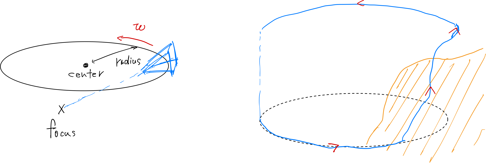

# Infinigen quick start
For more information, check https://www.notion.so/jungseokhong/Infinigen-2730005f4ded80e9a559fd9350c5bee8?source=copy_link. Feel free to request access to this notion page.

## What is Infinigen
Infinigen is a fully algorithmically randomized synthetic scene generating OSS. The latest code you can check from https://github.com/princeton-vl/infinigen. For the runtime information and explanation on its purpose of design, checking arXiv page will help https://arxiv.org/abs/2306.09310.

## Sample code
For detailed explanation of scene customization, you should check the documents in official repository. However, you can try executing this software with ``implement_infinigen.sh``. 

## What is customized in this code
This code is not the original version of the code base. Several modification has been made to ``infinigen/infinigen_examples/generate_nature.py`` and ``infinige/infinigen/core/placement/camera.py``. Specifically, algorithm for finding trajectory is significantly different from original one.
 
- Trajectory is not explored but configured with gin files.
- Trajectory is defined by ``focus``, the point where camera should always direct, ``center``, the center of the camera trajectory orbit, ``radius``, radius of the camera trajectory orbit, ``angular_velocity``, the angular speed at which camera goes around the trajectory.
- The scene collision avoidance algorithm in original code is replaced by simple collision avoidance by increasing the value of z value.
- You can use ``manipulate_gin.sh`` or ``manipulate_gin.py`` for generating configuration file. You need to configure boundings of each parameters to define the trajectory. Note that collision avoidance algorithm can distort the trajectory from complete circle in z axis.

The trajectory will look like this.

